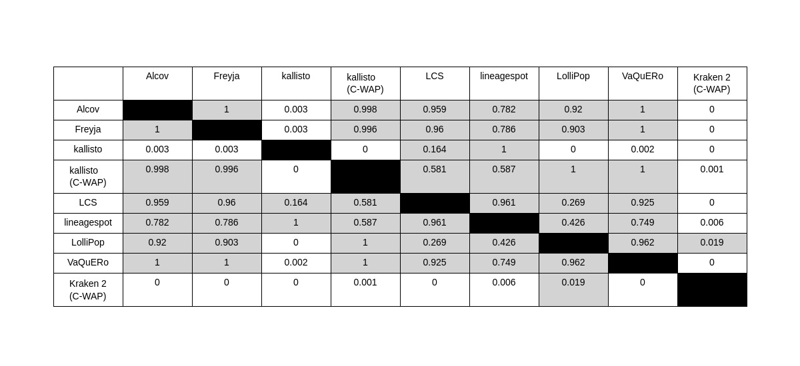
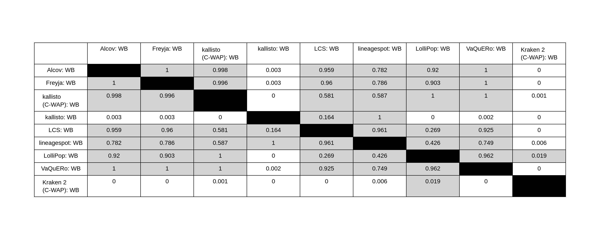
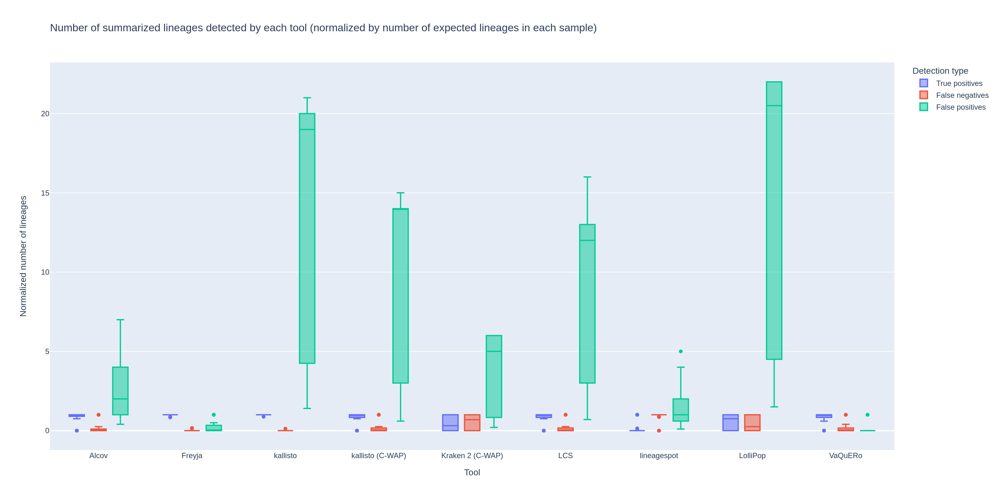
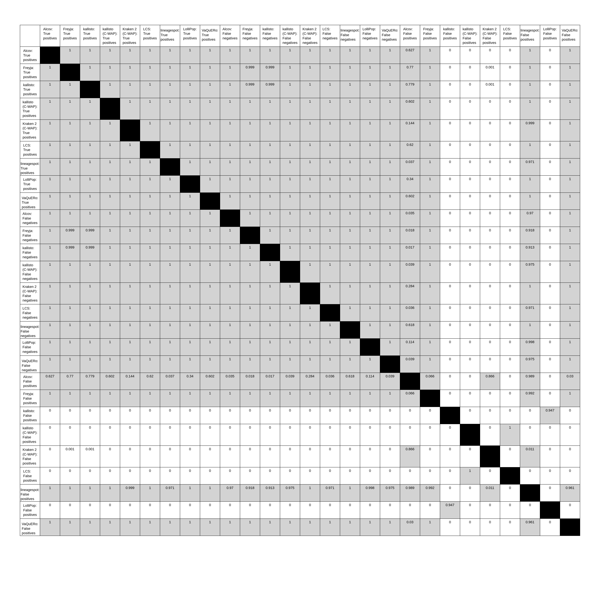

# Updates on statistics
After the preprint, we reran some analyses. Previous versions of this document show the original statistics followed by the updated ones, as they appear in the paper. Now we just show the final results.

# Supplemental Figure 2 (Section 3.1 and 3.2)
This covers all the stats related to Supplemental Figure 2 in the paper in sections 3.1 and 3.2. Calculations for these results can be found in [depth_stats.ipynb](coverage_depth_plots/depth_stats.ipynb) for those related to mean coverage depth and [breadth_stats.ipynb](coverage_depth_plots/breadth_stats.ipynb) for those related to breadth of coverage.

## Supplemental Figure 2a (Whole genome, Mean Coverage):
#### artic
ANOVA for artic samples comparing mean coverage across batches
p-value: 1.6871658192864803e-27	f-value: 113.03361517999129
The mean coverage was significantly different across WB (mean=9133.470789473684, std. dev.=1518.0989388605835), NWRB (mean=5036.284736842107, std. dev.=595.2729261745535), and PWRB (mean=9579.869736842104, std. dev.=1914.7779205891225), as determined by one-way ANOVA (F=113.03361517999129, p=1.6871658192864803e-27<0.01).

Tukey's HSD results:
The mean coverage for NWRB differed significantly from WB with p-value 0.0.
The mean coverage for NWRB differed significantly from PWRB with p-value 0.0.
No significant difference in mean coverage (p-value=0.376>0.01) was found between PWRB and WB.
#### varskip
ANOVA for varskip samples comparing mean coverage across batches
p-value: 1.874145781625117e-24	f-value: 93.02858359211771
The mean coverage was significantly different across WB: varskip (mean=11814.909736842106, std. dev.=1329.6259730699046), NWRB: varskip (mean=9485.827105263157, std. dev.=1355.1473030951245), and PWRB: varskip (mean=13330.339473684211, std. dev.=995.6526145494597), as determined by one-way ANOVA (F=93.02858359211771, p=1.874145781625117e-24<0.01).

Tukey's HSD results:
The mean coverage for NWRB: varskip differed significantly from WB: varskip with p-value 0.0.
The mean coverage for NWRB: varskip differed significantly from PWRB: varskip with p-value 0.0.
The mean coverage for PWRB: varskip differed significantly from WB: varskip with p-value 0.0.

## Supplemental Figure 2 (S gene, Mean Coverage):
#### artic
ANOVA for artic samples comparing mean coverage across batches
p-value: 5.320378360222447e-35	f-value: 174.56129939670765
The mean coverage was significantly different across WB: artic (mean=11085.813684210527, std. dev.=1673.6694894193079), NWRB: artic (mean=5985.2063157894745, std. dev.=539.6182620045049), and PWRB: artic (mean=11752.876315789472, std. dev.=1846.2408869689211), as determined by one-way ANOVA (F=174.56129939670765, p=5.320378360222447e-35<0.01).

Tukey's HSD results:
The mean coverage for NWRB: artic differed significantly from WB: artic with p-value 0.0.
The mean coverage for NWRB: artic differed significantly from PWRB: artic with p-value 0.0.
No significant difference in mean coverage (p-value=0.123>0.01) was found between PWRB: artic and WB: artic.

#### varskip
ANOVA for varskip samples comparing mean coverage across batches
p-value: 2.0683465697617048e-22	f-value: 80.95909070268559
The mean coverage was significantly different across WB: varskip (mean=9994.73552631579, std. dev.=1444.9227643320078), NWRB: varskip (mean=8144.81105263158, std. dev.=1756.8793992109518), and PWRB: varskip (mean=12964.560263157895, std. dev.=1774.9322758811936), as determined by one-way ANOVA (F=80.95909070268559, p=2.0683465697617048e-22<0.01).

Tukey's HSD results:
The mean coverage for NWRB: varskip differed significantly from WB: varskip with p-value 0.0.
The mean coverage for NWRB: varskip differed significantly from PWRB: varskip with p-value 0.0.
The mean coverage for PWRB: varskip differed significantly from WB: varskip with p-value 0.0.

## Supplemental Figure 2 (Whole genome, breadth of coverage @ 100X):
#### artic
ANOVA for artic samples comparing 100X ratio across batches
p-value: 0.00010565675826261319	f-value: 9.871889183160134
The 100X ratio was significantly different across WB (mean=0.9421905207805816, std. dev.=0.014204909109208077), NWRB (mean=0.9252741495233636, std. dev.=0.021246236580486872), and PWRB (mean=0.9376264049864479, std. dev.=0.018012376984790864), as determined by one-way ANOVA (F=9.871889183160134, p=0.00010565675826261319<0.01).

Tukey's HSD results:
The 100X ratio for NWRB differed significantly from WB with p-value 0.0.
The 100X ratio for NWRB differed significantly from PWRB with p-value 0.006.
No significant difference in 100X ratio (p-value=0.48>0.01) was found between PWRB and WB.

#### varskip
ANOVA for varskip samples comparing 100X ratio across batches
p-value: 0.026972587889072926	f-value: 3.7211675712864207
The 100X ratio was not significantly different across WB (mean=0.9221902659799791, std. dev.=0.015895526965077282), NWRB (mean=0.9059467275640107, std. dev.=0.04939564495083305), and PWRB (mean=0.9236649244675463, std. dev.=0.024090502972183063), as determined by one-way ANOVA (F=3.7211675712864207, p=0.026972587889072926<0.01).

## Supplemental Figure 2 (S gene, breadth of coverage @ 100X):
#### artic
ANOVA for artic samples comparing 100X ratio across batches
p-value: 6.864747964514754e-13	f-value: 35.47361321207015
The 100X ratio was significantly different across WB (mean=0.9423735995314118, std. dev.=0.015442145746343842), NWRB (mean=0.908083149512095, std. dev.=0.03288523650063371), and PWRB (mean=0.9479692426564975, std. dev.=0.018344346612438236), as determined by one-way ANOVA (F=35.47361321207015, p=6.864747964514754e-13<0.01).

Tukey's HSD results:
The 100X ratio for NWRB differed significantly from WB with p-value 0.0.
The 100X ratio for NWRB differed significantly from PWRB with p-value 0.0.
No significant difference in 100X ratio (p-value=0.521>0.01) was found between PWRB and WB.

#### varskip
ANOVA for varskip samples comparing 100X ratio across batches
p-value: 0.05544843727641408	f-value: 2.961392037957179
The 100X ratio was not significantly different across WB (mean=0.8739671738886605, std. dev.=0.06154774966858812), NWRB (mean=0.834922296581548, std. dev.=0.11582015585595426), and PWRB (mean=0.8748582395533456, std. dev.=0.07016797131090248), as determined by one-way ANOVA (F=2.961392037957179, p=0.05544843727641408<0.01).

## Supplemental Figure 2 (varskip vs artic, breadth of coverage @ 100X):
### (this is whole genome, but S gene results agree)
To take a closer look at the how the breadth of coverage varied for each primer scheme, we conducted a t-test, t(226)=

T-test for WB samples comparing 100X ratio across two batches
p-value: 3.6332022753764546e-08	t(82): 6.080208162745494
The 100X ratio was significantly different across WB: artic (mean=0.9421905207805816, std. dev.=0.014204909109208077), and WB: varskip (mean=0.9221902659799791, std. dev.=0.015895526965077282), as determined by t-test (t(82)=6.080208162745494, p=3.6332022753764546e-08<0.01).

## Supplemental Figure 2 (varskip vs artic, mean coverage depth):
### whole genome (S gene results agree - see below)
#### Individual backgrounds, whole genome (not used in paper except as aggregated below)
T-test for WB samples comparing mean coverage across two batches
p-value: 0.038899771401127034	t(74): -2.1026278469623394
The mean coverage was not significantly different across WB: artic (mean=11085.813684210527, std. dev.=1673.6694894193079), and WB: varskip (mean=11814.909736842106, std. dev.=1329.6259730699046), as determined by t-test (t(74)=-2.1026278469623394, p=0.038899771401127034<0.01).

T-test for NWRB samples comparing mean coverage across two batches
p-value: 8.354685625263744e-24	t(74): -14.79417126601802
The mean coverage was significantly different across NWRB: artic (mean=5985.2063157894745, std. dev.=539.6182620045049), and NWRB: varskip (mean=9485.827105263157, std. dev.=1355.1473030951245), as determined by t-test (t(74)=-14.79417126601802, p=8.354685625263744e-24<0.01).

T-test for PWRB samples comparing mean coverage across two batches
p-value: 1.4955597502398023e-05	t(74): -4.635837052310932
The mean coverage was significantly different across PWRB: artic (mean=11752.876315789472, std. dev.=1846.2408869689211), and PWRB: varskip (mean=13330.339473684211, std. dev.=995.6526145494597), as determined by t-test (t(74)=-4.635837052310932, p=1.4955597502398023e-05<0.01).

#### All backgrounds aggregated, whole geneome (using this for paper)
T-test for None samples comparing mean coverage across two batches
p-value: 2.6558388311566644e-08	t(226): -5.765431909861195
The mean coverage was significantly different across artic (mean=9607.965438596491, std. dev.=2970.4741321538113), and varskip (mean=11543.692105263159, std. dev.=2006.7524880896337), as determined by t-test (t(226)=-5.765431909861195, p=2.6558388311566644e-08<0.01).

### S gene
#### Individual backgrounds, S gene
T-test for WB samples comparing mean coverage across two batches
p-value: 0.01341909934457707	t(74): -2.5332393675958067
The mean coverage was not significantly different across WB: artic (mean=9133.470789473684, std. dev.=1518.0989388605835), and WB: varskip (mean=9994.73552631579, std. dev.=1444.9227643320078), as determined by t-test (t(74)=-2.5332393675958067, p=0.01341909934457707<0.01).

T-test for NWRB samples comparing mean coverage across two batches
p-value: 5.36372348032105e-16	t(74): -10.330125146843544
The mean coverage was significantly different across NWRB: artic (mean=5036.284736842107, std. dev.=595.2729261745535), and NWRB: varskip (mean=8144.81105263158, std. dev.=1756.8793992109518), as determined by t-test (t(74)=-10.330125146843544, p=5.36372348032105e-16<0.01).

T-test for PWRB samples comparing mean coverage across two batches
p-value: 1.3448414819442171e-11	t(74): -7.991380173565308
The mean coverage was significantly different across PWRB: artic (mean=9579.869736842104, std. dev.=1914.7779205891225), and PWRB: varskip (mean=12964.560263157895, std. dev.=1774.9322758811936), as determined by t-test (t(74)=-7.991380173565308, p=1.3448414819442171e-11<0.01).

#### All backgrounds aggregated, S gene (using this for paper)
T-test for None samples comparing mean coverage across two batches
p-value: 6.101644722099893e-12	t(226): -7.262003604653458
The mean coverage was significantly different across artic (mean=7916.541754385965, std. dev.=2507.8447877171507), and varskip (mean=10368.035614035087, std. dev.=2588.8303545772546), as determined by t-test (t(226)=-7.262003604653458, p=6.101644722099893e-12<0.01).

# Section 3.3
## ANOVA using WB (or all 3 backgrounds) to see the impact of tool choice on O/E ratios
Related calculations can be found partially in [observed_vs_expected_stats.ipynb](percent_of_expected/observed_vs_expected_stats.ipynb) and completely in [tool_box_plots_stats.ipynb](percent_of_expected/tool_box_plots_stats.ipynb).

#### ANOVA using WB to see the impact of tool choice on O/E ratios
The predictions between the tools were not statistically significant, again with the exception of kraken and sometimes kallisto, as determined by one-way ANOVA (F=9.438, p<1e-11) and Tukey’s post hoc HSD Test.
#### ANOVA using all three backgrounds to see the impact of tool choice on O/E ratios
The percent of expected was significantly different across Alcov (mean=86.5779407979408, std. dev.=34.47840872085612), Freyja (mean=86.65136103633094, std. dev.=42.088069341411504), kallisto (C-WAP) (mean=93.65076719576719, std. dev.=50.68984354862519), kallisto (mean=60.98556959064327, std. dev.=29.169775212944643), LCS (mean=78.47920233463034, std. dev.=45.13270619477752), lineagespot (mean=35.97294117647059, std. dev.=43.03442165358823), LolliPop (mean=94.03733333333335, std. dev.=48.81488145230662), VaQuERo (mean=89.98541025641025, std. dev.=32.325245782664226), and Kraken 2 (C-WAP) (mean=125.51260317460317, std. dev.=112.09401604878896), as determined by one-way ANOVA (F=24.31726888130226, p=7.288741302086736e-36<0.01).
No significant difference in percent of expected (p-value=1.0>0.01) was found between Alcov and Freyja. Related Tukey's HSD results can be found in [tool_box_plots_stats.ipynb](percent_of_expected/tool_box_plots/overall-combined-percent-expected-box-p-values.png).
<!-- Tukey's HSD results in image from observed_vs_expected_stats.ipynb (same as the first one below):
 -->

# Section 3.4

## Figure 2:
Below are anova/tukey's HSD results related to the box plots comparing O/E ratios across tools.
#### Tukey's HSD results with all three backgrounds included
We chose to use the combined dataset rather than just one background. Since the backgrounds didn't make a massive difference on mean coverage, combining the results essentially gives us more replicates for our statistical tests. Looking at the results when only WB samples are included, we get these Tukey's HSD results:

## 7 ANOVA (one-per-tool) comparing variance in O/E by treatment group
The variances between samples from different backgrounds were insignificant (p>0.05 for all) via ANOVA performed to test the effect of sample matrix on the estimated relative abundance for all abundance-estimating tools. Related calculations can be found in [observed_vs_expected_stats.ipynb](percent_of_expected/observed_vs_expected_stats.ipynb)

## 10 ANOVA (one-per-lineage) comparing variance in O/E by treatment group
These results are summarized in Figure 2 (Section 3.4).
Data currently stored in [Table 2 data](percent_of_expected/observed_vs_expected/table2_data_lineage_anova_each_bg.csv). To prepare for paper, open in excel, drop index column, and save as table in ms Word. Calculations can be found in [observed_vs_expected_stats.ipynb](percent_of_expected/observed_vs_expected_stats.ipynb).

# Section 3.6
## Figure 4
Normalized detection count box plot produced in [detection.ipynb](detection_plots/detection.ipynb).
Shows normalized count distribution of false positives, false negatives, and true positives for each tool.

