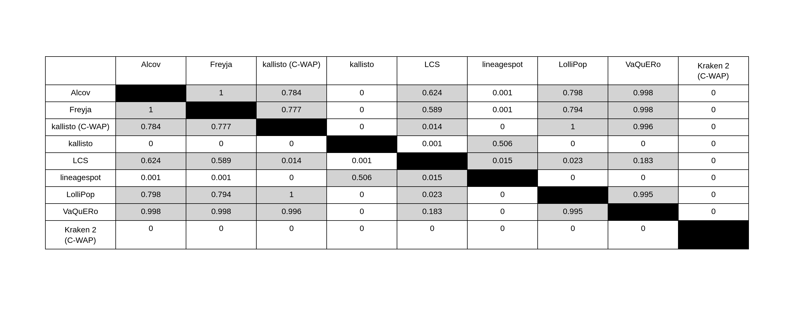

# Updates on statistics
After the preprint, we reran some analyses. This document currently shows the original statistics followed by the updated ones, as they appear in the paper. Once we've updated everything in the paper, the old statistics will be removed and this will just show the final results.

# Figure 1 (Section 3.1 and 3.2)
This covers all the stats related to Figure 1 in the paper in sections 3.1 and 3.2. Calculations for these results can be found in [depth_stats.ipynb](coverage_depth_plots/depth_stats.ipynb) for those related to mean coverage depth and [breadth_stats.ipynb](coverage_depth_plots/breadth_stats.ipynb) for those related to breadth of coverage.

## Figure 1a (Whole genome, Mean Coverage):
### Old:
#### artic
Mean coverage for WB (mean=96.925, std. dev.=0.763) differed significantly from NWRB (mean=95.580, std. dev.=1.136), and PWRB (mean=95.510, std. dev.=2.010), as determined by one-way ANOVA (F=12.252, p<1e-4). 
Tukey’s HSD test showed significant differences between WB and each wastewater background (p<0.01 for each), but the mean coverage values for samples in wastewater backgrounds did not vary significantly from each other (p>0.01)
#### varskip
For Varskip, all three groups varied significantly from each other based on one-way ANOVA (F=26.194, p<1e-9) and Tukey’s HSD test (p<0.01 between all groups), with mean percent coverage the lowest for NWRB (mean=94.084, std. dev.=1.074), increasing with PWRB (mean=95.168, std. dev.=1.590), and increasing again with WB (mean=96.264, std. dev.=1.219). This is similar to the pattern of coverage values obtained using the Artic v4.1 primers...

### New:
#### artic
ANOVA for artic samples comparing mean coverage across batches
p-value: 1.6871658192864803e-27	f-value: 113.03361517999129
The mean coverage was significantly different across WB (mean=9133.470789473684, std. dev.=1518.0989388605835), NWRB (mean=5036.284736842107, std. dev.=595.2729261745535), and PWRB (mean=9579.869736842104, std. dev.=1914.7779205891225), as determined by one-way ANOVA (F=113.03361517999129, p=1.6871658192864803e-27<0.01).

Tukey's HSD results:
The mean coverage for NWRB differed significantly from WB with p-value 0.0.
The mean coverage for NWRB differed significantly from PWRB with p-value 0.0.
No significant difference in mean coverage (p-value=0.376>0.01) was found between PWRB and WB.
#### varskip
ANOVA for varskip samples comparing mean coverage across batches
p-value: 1.874145781625117e-24	f-value: 93.02858359211771
The mean coverage was significantly different across WB: varskip (mean=11814.909736842106, std. dev.=1329.6259730699046), NWRB: varskip (mean=9485.827105263157, std. dev.=1355.1473030951245), and PWRB: varskip (mean=13330.339473684211, std. dev.=995.6526145494597), as determined by one-way ANOVA (F=93.02858359211771, p=1.874145781625117e-24<0.01).

Tukey's HSD results:
The mean coverage for NWRB: varskip differed significantly from WB: varskip with p-value 0.0.
The mean coverage for NWRB: varskip differed significantly from PWRB: varskip with p-value 0.0.
The mean coverage for PWRB: varskip differed significantly from WB: varskip with p-value 0.0.

## Figure 1 (S gene, Mean Coverage):
### Old:
Not explored.

## New:
#### artic
ANOVA for artic samples comparing mean coverage across batches
p-value: 5.320378360222447e-35	f-value: 174.56129939670765
The mean coverage was significantly different across WB: artic (mean=11085.813684210527, std. dev.=1673.6694894193079), NWRB: artic (mean=5985.2063157894745, std. dev.=539.6182620045049), and PWRB: artic (mean=11752.876315789472, std. dev.=1846.2408869689211), as determined by one-way ANOVA (F=174.56129939670765, p=5.320378360222447e-35<0.01).

Tukey's HSD results:
The mean coverage for NWRB: artic differed significantly from WB: artic with p-value 0.0.
The mean coverage for NWRB: artic differed significantly from PWRB: artic with p-value 0.0.
No significant difference in mean coverage (p-value=0.123>0.01) was found between PWRB: artic and WB: artic.
#### varskip
ANOVA for varskip samples comparing mean coverage across batches
p-value: 2.0683465697617048e-22	f-value: 80.95909070268559
The mean coverage was significantly different across WB: varskip (mean=9994.73552631579, std. dev.=1444.9227643320078), NWRB: varskip (mean=8144.81105263158, std. dev.=1756.8793992109518), and PWRB: varskip (mean=12964.560263157895, std. dev.=1774.9322758811936), as determined by one-way ANOVA (F=80.95909070268559, p=2.0683465697617048e-22<0.01).

Tukey's HSD results:
The mean coverage for NWRB: varskip differed significantly from WB: varskip with p-value 0.0.
The mean coverage for NWRB: varskip differed significantly from PWRB: varskip with p-value 0.0.
The mean coverage for PWRB: varskip differed significantly from WB: varskip with p-value 0.0.

## Figure 1b (mornalized read depth):
Dropped.

## Figure 1 (Whole genome, breadth of coverage @ 100X):
### New:
#### artic
ANOVA for artic samples comparing 100X ratio across batches
p-value: 0.00010565675826261319	f-value: 9.871889183160134
The 100X ratio was significantly different across WB (mean=0.9421905207805816, std. dev.=0.014204909109208077), NWRB (mean=0.9252741495233636, std. dev.=0.021246236580486872), and PWRB (mean=0.9376264049864479, std. dev.=0.018012376984790864), as determined by one-way ANOVA (F=9.871889183160134, p=0.00010565675826261319<0.01).

Tukey's HSD results:
The 100X ratio for NWRB differed significantly from WB with p-value 0.0.
The 100X ratio for NWRB differed significantly from PWRB with p-value 0.006.
No significant difference in 100X ratio (p-value=0.48>0.01) was found between PWRB and WB.

#### varskip
ANOVA for varskip samples comparing 100X ratio across batches
p-value: 0.026972587889072926	f-value: 3.7211675712864207
The 100X ratio was not significantly different across WB (mean=0.9221902659799791, std. dev.=0.015895526965077282), NWRB (mean=0.9059467275640107, std. dev.=0.04939564495083305), and PWRB (mean=0.9236649244675463, std. dev.=0.024090502972183063), as determined by one-way ANOVA (F=3.7211675712864207, p=0.026972587889072926<0.01).

## Figure 1 (S gene, breadth of coverage @ 100X):
### New:
#### artic
ANOVA for artic samples comparing 100X ratio across batches
p-value: 6.864747964514754e-13	f-value: 35.47361321207015
The 100X ratio was significantly different across WB (mean=0.9423735995314118, std. dev.=0.015442145746343842), NWRB (mean=0.908083149512095, std. dev.=0.03288523650063371), and PWRB (mean=0.9479692426564975, std. dev.=0.018344346612438236), as determined by one-way ANOVA (F=35.47361321207015, p=6.864747964514754e-13<0.01).

Tukey's HSD results:
The 100X ratio for NWRB differed significantly from WB with p-value 0.0.
The 100X ratio for NWRB differed significantly from PWRB with p-value 0.0.
No significant difference in 100X ratio (p-value=0.521>0.01) was found between PWRB and WB.

#### varskip
ANOVA for varskip samples comparing 100X ratio across batches
p-value: 0.05544843727641408	f-value: 2.961392037957179
The 100X ratio was not significantly different across WB (mean=0.8739671738886605, std. dev.=0.06154774966858812), NWRB (mean=0.834922296581548, std. dev.=0.11582015585595426), and PWRB (mean=0.8748582395533456, std. dev.=0.07016797131090248), as determined by one-way ANOVA (F=2.961392037957179, p=0.05544843727641408<0.01).

## Figure 1 (varskip vs artic, breadth of coverage @ 100X):
### New: (this is whole genome, but S gene results agree)
T-test for WB samples comparing 100X ratio across two batches
p-value: 3.6332022753764546e-08	t(82): 6.080208162745494
The 100X ratio was significantly different across WB: artic (mean=0.9421905207805816, std. dev.=0.014204909109208077), and WB: varskip (mean=0.9221902659799791, std. dev.=0.015895526965077282), as determined by t-test (t(82)=6.080208162745494, p=3.6332022753764546e-08<0.01).

## Figure 1 (varskip vs artic, mean coverage depth):
### Old:
comparing coverage attained by Artic v4.1 (mean=96.01, std. dev.=1.538) and Varskip v2a (mean=95.17, std. dev.=1.578), the two primer schemes showed significantly different coverage, t(78)=4.036, p<0.001 with Artic having the higher mean and lower standard deviation
### New: (this is whole genome, but S gene results agree)
T-test for WB samples comparing mean coverage across two batches
p-value: 0.038899771401127034	t(74): -2.1026278469623394
The mean coverage was not significantly different across WB: artic (mean=11085.813684210527, std. dev.=1673.6694894193079), and WB: varskip (mean=11814.909736842106, std. dev.=1329.6259730699046), as determined by t-test (t(74)=-2.1026278469623394, p=0.038899771401127034<0.01).

# Section 3.3
## ANOVA using WB to see the impact of tool choice on O/E ratios
Related calculations can be found partially in [observed_vs_expected_stats.ipynb](percent_of_expected/observed_vs_expected_stats.ipynb) and completely in [tool_box_plots_stats.ipynb](percent_of_expected/tool_box_plots_stats.ipynb).

### Old:
The predictions between the tools were not statistically significant, again with the exception of kraken and sometimes kallisto, as determined by one-way ANOVA (F=10.655, p<1e-11) and Tukey’s post hoc HSD Test.
### New:
The predictions between the tools were not statistically significant, again with the exception of kraken and sometimes kallisto, as determined by one-way ANOVA (F=9.438, p<1e-11) and Tukey’s post hoc HSD Test.
<!-- Tukey's HSD results in image from observed_vs_expected_stats.ipynb (same as the first one below):
 -->

We need to decide which of the below results to use, since they vary slightly.
#### Tukey's HSD results if only looking at WB

#### Tukey's HSD results if including all three backgrounds

# Section 3.4
## 7 ANOVA (one-per-tool) comparing variance in O/E by treatment group
Related calculations can be found in [observed_vs_expected_stats.ipynb](percent_of_expected/observed_vs_expected_stats.ipynb)
### Old:
The variances between samples from different backgrounds were insignificant (p>0.05 for all) via ANOVA performed to test the effect of sample matrix on the estimated relative abundance for all abundance-estimating tools.
### New:
Same as old.

## ANOVA comparing variance in O/E by tool
### Old: 
### New: 

## 10 ANOVA (one-per-lineage) comparing variance in O/E by treatment group
These results are summarized in Figure 2 (Section 3.4).
### old:
See original submission, Table 2
### new:
Data currently stored in [Table 2 data](percent_of_expected/observed_vs_expected/table2_data_lineage_anova_each_bg.csv). To prepare for paper, open in excel, drop index column, and save as table in ms Word.